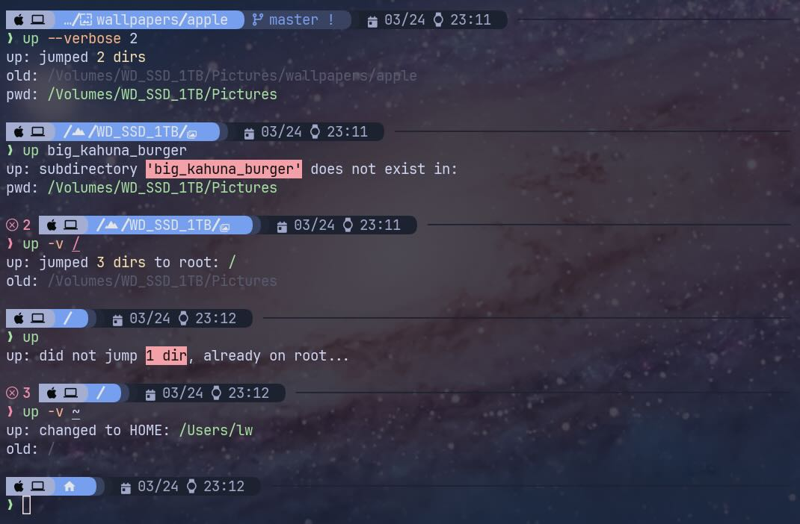

<h1>
    
    Navigate <code>up</code> the Directory Tree with Ease | Bash & Zsh Navigation Script
</h1>

`up` is a Bash and Zsh-compatible script designed to simplify navigating up the directory tree to parent directories. Quickly jump multiple levels, autocomplete subdirectory names, and even handle Unicode paths—all in a simple command!

Say adiós to typing `cd ..` repeatedly and streamline your workflow with `up`.


## 📜 Table of Contents
- [Key Features](#-key-features)
- [Installation](#-installation)
- [Usage](#-usage)
- [Testing](#-testing-in-bats-bash-automated-testing-system)
- [Known Issues](#-known-issues)
- [TODOs and Future Ideas](#-todos-and-future-ideas)
- [Contributing](#-contributing)
- [Credits](#credits)

## ⭐ Key Features

1. **Simple Multi-Level Navigation**:
    - Jump up multiple directory levels by index:
        - `up` (jumps one level)
        - `up 2` (jumps two levels)
        - `up 3` (jumps three levels)

2. **Powerful Tab Completion**:
    - Jump directly to a parent directory name (e.g. `up Pictures/`).
    - Supports Unicode directories (e.g., `ダン·メイソン/`, `日本語/`, `привет/`, emojis like `📂/`).
    - Auto-escapes special ASCII characters like `*`, `[`, `]`, and spaces (e.g., `\!\[special\ dir\]/`).
    - Quickly autocomplete subdirectory names by prefix.

3. **Verbose Output for Clarity**:
    - Use verbose mode (`-v`) to display detailed information about directory changes.
    - Get insights like the number of levels jumped, old directory (`$OLDPWD`), and new directory (`$PWD`).
    - Enable persistent verbose mode with `_UP_ALWAYS_VERBOSE=true`.
    - Change display output colors with `_UP_PWD_STYLE`, `_UP_ERR_STYLE`, etc., to match your theme.
        * Disable output styling with `_UP_NO_STYLES=true`.

4. **Handles Edge Cases Gracefully**:
    - Navigate to `HOME` with `up ~` from any directory.
    - Subdirectories named after flags (e.g., `--help/`) or containing integers (e.g., `2/`) are supported seamlessly.

5. **Robust Error Handling**:
    - Proper exit status codes returned on errors.
    - Useful for shell configurations that utilize exit codes like the [starship](https://starship.rs/) prompt.

6. **Compatibility**:
    - Fully compatible with both Bash and Zsh.
    - Minimal dependencies ensure fast, efficient performance, and a simple instalation.

## ⚙ Installation

Download the git repo to your preferred destination.

To download the repo to `~/.config`:

```sh
git clone https://github.com/LittleWalter/up ~/.config/up
```

### Bash

Add to `.bashrc` or `.bash_profile` on Apple macOS systems:

```bash
source ~/.config/up/up.bash # The `up` function
source ~/.config/up/up-completion.bash # `up` completion
```

#### Quick Bash Installation

Assuming your Bash config is at `~/.bashrc`, use this snippet to download and append the lines in one step:

```sh
git clone https://github.com/LittleWalter/up ~/.config/up
echo 'source ~/.config/up/up.bash' >> ~/.bashrc
echo 'source ~/.config/up/up-completion.bash' >> ~/.bashrc
```

### Zsh

Fully compatible with Zsh using `bashcompinit` for seamless integration.

The `autoload` lines enable autocompletion modules.

Add to `.zshrc`:

```bash
autoload -U +X compinit && compinit # Enable Zsh completion 
autoload -U +X bashcompinit && bashcompinit # Enable Bash completion compatibility

source ~/.config/up/up.bash # The `up` function
source ~/.config/up/up-completion.bash # `up` completion
```

#### Quick Zsh Installation

Assuming your Zsh config is at `~/.zshrc`, use this snippet to download and append the lines in one step:

```sh
git clone https://github.com/LittleWalter/up ~/.config/up
echo 'autoload -U +X compinit && compinit' >> ~/.zshrc
echo 'autoload -U +X bashcompinit && bashcompinit' >> ~/.zshrc
echo 'source ~/.config/up/up.bash' >> ~/.zshrc
echo 'source ~/.config/up/up-completion.bash' >> ~/.zshrc
```

### 📝 Optional Sidenote on `HOME` Directory Organization

Following best practices, I recommend using the [XDG Base Directory Specification](https://specifications.freedesktop.org/basedir-spec/latest/) to reduce `HOME` directory clutter. Use either `XDG_CONFIG_HOME` or `XDG_DATA_HOME`, depending on where you like to keep shell scripts.

I imagine most people would use `XDG_CONFIG_HOME` and consider these configuration files.

By default, `XDG_CONFIG_HOME` is `$HOME/.config` and `XDG_DATA_HOME` is `$HOME/.local/share`. However, these paths might not be explicitly defined in your shell configuration; verify with `echo $XDG_CONFIG_HOME`.

Within your `.bashrc` or `.zshrc`, or more appropriately `.zshenv`, you may define these as environment variables.

```sh
export XDG_CONFIG_HOME="$HOME/.config" # Configuration files
export XDG_DATA_HOME="$HOME/.local/share" # Persistent data storage
export XDG_CACHE_HOME="$HOME/.cache" # Non-essential files such as shell command history, log files, etc.
```

## ⌨ Usage

For example usage, assume `pwd` command returns:

```sh
$ pwd
/Volumes/WD_SSD_1TB/Pictures/wallpapers/apple
```

### Jump to the nth Subdirectory

```sh
$ up <optional: integer>
```

#### Jump 1 Subdirectory

```sh
$ up
$ pwd
/Volumes/WD_SSD_1TB/Pictures/wallpapers
```

#### Jump 3 Subdirectories

```sh
$ up 3
$ pwd
/Volumes/WD_SSD_1TB
```

### Jump to a Subdirectory Name

#### Display the Autocomplete List

```sh
$ up <tab>
/            Pictures/    Volumes/     WD_SSD_1TB/  wallpapers/
```

#### Autocomplete Subdirectory Names with Prefix

To autocomplete the only subdirectory that starts with `Pic`:

```sh
$ up Pic<tab>
$ up Pictures/
```

### Display Help


```sh
$ up help
$ up -h
$ up --help
```

### Verbose Mode

Just like the `cd` command, `up` will generally not output text upon successful execution.

To display extra information such as `$OLDPWD` and `$PWD` after calling `up`:

```sh
$ up verbose [integer or subdirectory name]
$ up -v [integer or subdirectory name]
$ up --verbose [integer or subdirectory name]
```

#### Verbose Mode Examples

```sh
$ up -v Pictures/
up: jumped 2 dirs to nearest: Pictures
old: /Volumes/WD_SSD_1TB/Pictures/wallpapers/apple
pwd: /Volumes/WD_SSD_1TB/Pictures
```

```sh
$ up verbose 2
up: jumped 2 dirs
old: /Volumes/WD_SSD_1TB/Pictures/wallpapers/apple
pwd: /Volumes/WD_SSD_1TB/Pictures
```

#### `_UP_ALWAYS_VERBOSE` environment variable

Set the optional environment flag to always display verbose mode in your `.bashrc`, `.zshrc`, or `.zshenv`.

```bash
export _UP_ALWAYS_VERBOSE=true
```

### Navigate to `HOME` directory

For the sake of completeness, navigating back to `HOME` path is included.

`HOME` is the only valid full path `up` allows; all other arguments must be a single subdirectory name.

You don't have to be in a `HOME` subdirectory for this to work.

```sh
$ up ~
$ up $HOME
$ up /home/mwallace # Unix-like example
$ up /Users/vvega   # macOS example
```

### Output Style Environment Variables

Define output styles to tailor how directory changes, errors, and other terminal messages appear. Setting environment variables allows you to enhance readability and match colors to your terminal theme.

Set ANSI escape sequences in your shell configuration file (i.e., `.bashrc`, `.zshrc`, or `.zshenv`) to avoid editing `up.bash` manually.

* `_UP_DIR_CHANGE_STYLE` for the number of parent directories jumped.
    - Default: Orange (`\033[0;33m`)
* `_UP_ERR_STYLE` for error messages.
    - Default: Red (`\033[0;31m`)
* `_UP_OLDPWD_STYLE` for the previous directory.
    - Default: Light Gray (`\033[0;37m`)
* `_UP_PWD_STYLE` for your current working directory.
    - Default: Light Green (`\033[0;32m`)

Default values represent standard ANSI colors, which work reliably across most terminal emulators.

Some terminal emulators may be flexible displaying basic colors and automatically match your preconfigured terminal theme, depending on the capabilities of your terminal emulator (e.g., [WezTerm](https://wezterm.org/) for advanced color support).

Refer to [this GitHub Gist](https://gist.github.com/JBlond/2fea43a3049b38287e5e9cefc87b2124) for more styling ideas.

#### Example: Custom Style Theming

If your terminal emulator supports the full RGB spectrum, you may define style variables using a mix-and-match of foreground (`\033[38;2;<r>;<g>;<b>m`) and background (`\033[48;2;<r>;<g>;<b>m`) colors.

```bash
# `up` style theme: based on Catppuccin Mocha
# REF: https://github.com/catppuccin/catppuccin
# NOTE: ANSI escape format
#       Foreground = "\033[38;2;<r>;<g>;<b>m"
#       Background = "\033[48;2;<r>;<g>;<b>m"
export _UP_DIR_CHANGE_STYLE="\033[38;2;249;226;175m" # Yellow
export _UP_ERR_STYLE="\033[48;2;243;160;168m\033[38;2;30;30;46m" # Red background, "Crust" foreground
export _UP_OLDPWD_STYLE="\033[38;2;88;91;112m" # "Surface 2"
export _UP_PWD_STYLE="\033[38;2;166;227;161m" # Green
```


#### Turning Off Styling

To turn off styling and display plaintext only, add the following line to your `.bashrc`, `.zshrc`, or `.zshenv`:

```bash
export _UP_NO_STYLES=true
```

## 🔬 Testing in Bats (Bash Automated Testing System)

Tests are written for [`bats-core`](https://github.com/bats-core/bats-core), a test framework for Bash.

Refer to the [official documentation of Bats](https://bats-core.readthedocs.io/en/stable/installation.html) for installation information.

###  Homebrew Installation

Cheers to easy installation methods! 🍺

```sh
$ brew install bats-core
```

### Running Tests

```sh
$ bats up_test.bats # Test the `up` function
$ bats up-completion_test.bats # Test the `_up` function for Bash completions
```

## 🐞 Known Issues

There may be skill-related limitations: I’m not a Bash scripting expert.

* No color support for tab completion list
    * I could not get Zsh to use `LS_COLORS` via `zstyle` settings.
* Tab completion list not in order of `PWD`
    * There’s no guarantee of the completion list order.

## ✅ TODOs and 💡Future Ideas

Possible ideas to work on.

- [x] Refactor `up.bash` to make it more readable and maintainable.
    * More refinements later.
- [ ] Add more styling examples in this `README.md`, e.g., Dracula.
- [ ] Write a fish-compatible version.
    * I'm not using [fish](https://fishshell.com/) as my primary shell.
- [ ] Write a binary version of `up.bash` in a language like Go or Rust for universal shell compatibility. (Better idea?)
    * Only completion scripts for target shells would need to be created.

## 🤝 Contributing

Contributions and suggestions are welcome!

If you’d like to contribute:
1. Fork the repository.
2. Make your changes in a feature branch.
3. Open a pull request with your proposed changes.

For major changes, please open an issue to discuss what you’d like to improve.

Before submitting a pull request, please:
- Run the tests with `bats` to ensure everything works as expected.

## 🍿Credits

Thanks to the original script writers and public shell configs!

### [Derek Taylor's Dotfiles (dwt1 on GitLab)](https://gitlab.com/dwt1/dotfiles)

Originally, I used Derek Taylor's `up` function unmodified within his [`.zshrc`](https://gitlab.com/dwt1/dotfiles/-/blob/master/.zshrc?ref_type=heads):

```bash
up () {
  local d=""
  local limit="$1"

  # Default to limit of 1
  if [ -z "$limit" ] || [ "$limit" -le 0 ]; then
    limit=1
  fi

  for ((i=1;i<=limit;i++)); do
    d="../$d"
  done

  # perform cd. Show error if cd fails
  if ! cd "$d"; then
    echo "Couldn't go up $limit dirs.";
  fi
}
```

This minimalist function works well for navigating up by the number of directories.

### [Oliver Weiler's `up` Bash Scripts (helpermethod on GitHub)](https://github.com/helpermethod/up)

I later found [this simple `up` Bash script](https://github.com/helpermethod/up/blob/main/up) to navigate by subdirectory name, complete with tab completion and [bats](https://bats-core.readthedocs.io/en/stable/index.html) scripts. 

```bash
up() {
  (($# == 0)) && cd .. && return
  [[ $1 == / ]] && cd / && return

  # shellcheck disable=SC2164
  cd "${PWD%"${PWD##*/"$1"/}"}"
}
```

My modifications are a result of combining the functionalities of these two `up` functions. 

It's also just another excuse to fiddle with my Zsh config and do some light Bash scripting. ☺️

### [Jonathan Suh's Terminal Colors for Bash (jonsuh on GitHub)](https://gist.github.com/jonsuh/3c89c004888dfc7352be)

Instead of writing ANSI escape codes manually, use this simple list of 15 colors and a reset value in your shell config.
